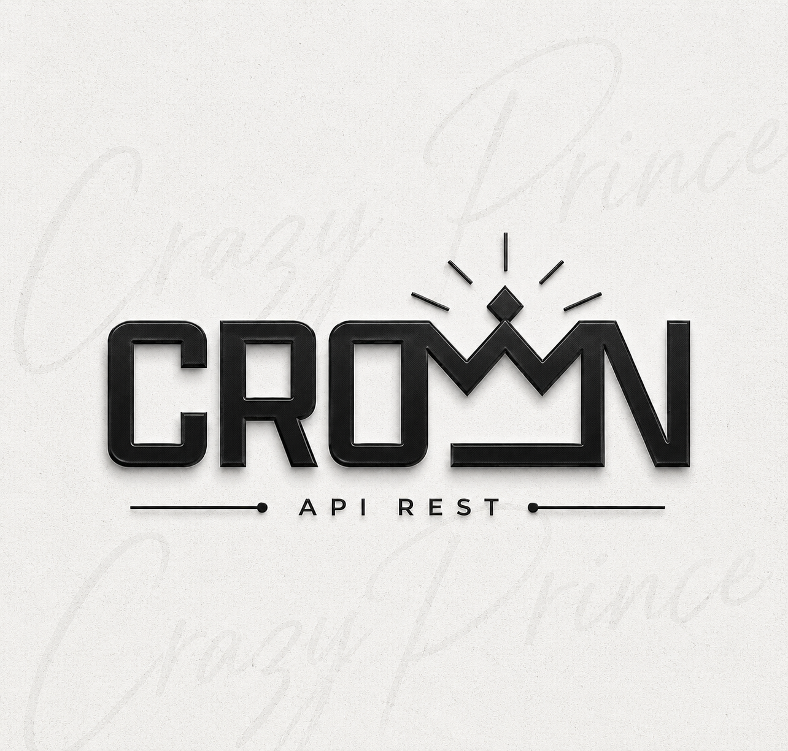

<div align="center">

  

  # CROWN API

  **Plateforme d'API REST publique moderne, ultra-rapide et modulaire.**  
  *Propulsée par CrazyPrince, Développeur Camerounais.*

  <p>
    <a href="https://nodejs.org/"></a>
    <a href="https://expressjs.com/"></a>
    <a href="https://axios-http.com/"></a>
    <a href="https://developer.mozilla.org/fr/docs/Web/JavaScript"></a>
    
    
  </p>

  <p>
    <a href="#-d%C3%A9ploiement-rapide"><strong>Déployer</strong></a> •
    <a href="#-caract%C3%A9ristiques"><strong>Caractéristiques</strong></a> •
    <a href="#-installation--d%C3%A9marrage"><strong>Installation</strong></a> •
    <a href="#-documentation--exemples"><strong>Exemples</strong></a> •
    <a href="#-sources-de-redon"><strong>Sources</strong></a> •
    <a href="#-contact--support"><strong>Contact</strong></a>
  </p>

</div>

---

##  Déploiement Rapide

Déployez votre propre instance de **CROWN API** en un clic sur vos plateformes favorites :

<div align="center">

[](https://dashboard.render.com/blueprint/new?repo=https%3A%2F%2Fgithub.com%2FCrazyPrince12%2Fapi)
[](https://app.koyeb.com/deploy?type=git&repository=github.com/CrazyPrince12/api&branch=main&name=crown-api&ports=2035;http;/)
[](https://replit.com/github/CrazyPrince12/api)

</div>

---

##  Caractéristiques

- **481+ Endpoints haute performance** : Téléchargements multimédias (YouTube, TikTok, Instagram, Facebook, Twitter/X, Spotify, Soundcloud, Pinterest, etc.), IA, Outils web, Recherche, Canvas, Memes, Logos Flaming et NSFW.
- **Réponses JSON uniformisées** : Structure claire `{ "status": true, "resultado": { ... }, "creator": "CrazyPrince" }`.
- **Authentification & Gestion des clés** : Système de quotas journaliers, clés personnalisables, gestion des statuts premium et bannissements en temps réel.
- **Interface UI 2026** : Dashboard élégant, switch thème sombre/clair, documentation interactive avec coloration syntaxique et code multi-langages (Node.js, TypeScript, Python, cURL).
- **Intégration bot simplifiée** : Compatible avec vos bots WhatsApp, Telegram, Discord via `axios` ou `fetch`.

---

##  Installation & Démarrage

### Prérequis
- [Node.js](https://nodejs.org/) v18 ou supérieur
- `npm` ou `yarn`

### 1. Cloner le dépôt
```bash
git clone https://github.com/CrazyPrince12/api.git
cd api
```

### 2. Installer les dépendances
```bash
npm install --omit=optional
```

### 3. Configurer l'environnement
Copiez le fichier d'exemple et personnalisez vos variables :
```bash
cp example.env .env
```

| Variable | Description | Valeur par défaut |
| :--- | :--- | :--- |
| `PORT` | Port d'écoute du serveur | `2035` |
| `JWT_SECRET` | Clé secrète pour les jetons de session | `votre_cle_secrete_jwt` |
| `free_user_limit` | Quota quotidien utilisateurs gratuits | `10000` |
| `premium_user_limit` | Quota quotidien utilisateurs premium | `1000000` |
| `new_user_verification` | Vérification par e-mail | `false` (ou `true` avec SMTP) |

### 4. Lancer le serveur
```bash
npm start
```
Accédez au dashboard sur `http://localhost:2035`.

---

##  Documentation & Exemples

### Exemple en Node.js (Axios)
```javascript
const axios = require('axios');

async function searchYouTube(query, apiKey) {
  try {
    const response = await axios.get('https://api-domain.com/api/ytsearch', {
      params: {
        text: query,
        apikey: apiKey
      }
    });
    console.log(response.data);
  } catch (error) {
    console.error('Erreur API :', error.response?.data || error.message);
  }
}

searchYouTube('Alan Walker Faded', 'CrazyPrince');
```

### Exemple en TypeScript (Fetch)
```typescript
interface ApiResponse<T = any> {
  status: boolean;
  resultado: T;
  creator: string;
}

async function getStatus(): Promise<ApiResponse> {
  const res = await fetch('https://api-domain.com/status');
  return res.json();
}
```

---

##  Sources de Redon

CROWN API intègre et optimise des ponts vers des architectures de référence pour assurer la stabilité des flux :
- [api.delirius.online](https://api.delirius.online)
- [api.dorratz.com](https://api.dorratz.com)
- [api.popcat.xyz](https://api.popcat.xyz)
- [flamingtext.com](https://flamingtext.com)

---

##  Gestion des Utilisateurs

Les identifiants et clés API sont gérés dans `database.json`.  
- **Clé API par défaut** : `CrazyPrince`
- **Clé API Premium pré-configurée** : `CRAZY237`
- **Ajout manuel** : Ajoutez directement un nouvel objet utilisateur dans `database.json` ; les modifications sont immédiatement prises en compte sans redémarrage.

---

##  Contact & Support

- **Développeur** : CrazyPrince (Développeur Camerounais)
- **WhatsApp** : [+237 694 268 225](https://wa.me/237694268225)
- **GitHub** : [BanditDapi](https://github.com/BanditDapi/)
- **Paiements & Dons** : Mobile Money / Orange Money uniquement au **+237 694 268 225**

---

<div align="center">
  <sub>© 2026 CROWN API. Tous droits réservés. Développé avec excellence au Cameroun par CrazyPrince.</sub>
</div>
